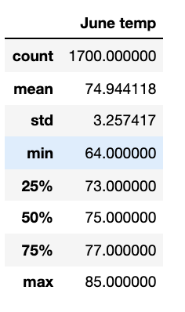
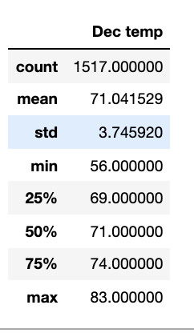

# Surfs Up

## Overview
The goal of the project is to determine if a prospective surf and ice cream shop business can sustainably operate year-round as opposed to a seasonal business. This project uses Advanced Data Storage and Retrieval to efficiently produce an analysis of temperature trends in Oahu, Hawaii. Specifically, summary statistics of temperature data were requested for the months of June and December.

## FEATURES AND DATA SOURCES
**Data Source** : hawaii.sqlite   
**Programming Files**: SurfsUp_Challenge.ipynb, climate_analysis.ipynb   
**Data Tools**: Python SQL toolkit (SQLAlchemy), Object Relational Mapper, pandas, numpy   
**Software**: SQLlite, Python 3.9.2, Flask, Jupyter Notebook   

## Results
- From the below snapshot we can see the average temperature for the month of June is 74.9&deg; and the average temperature for the month of Dec is 71&deg;F. There is a difference of 4&deg;F between the two months. 
- From the snapshots below we can see December does get slightly colder when compared to June, the max temperature in Dec is 83&deg;F when compared to 85&deg;F in June, i.e. Max temp in December is lower by 2&deg;F.
- From the snapshot we can see the max variation in temperature is around the minimum  temperature, December has a minimum  temperature of 56&deg;F when compared to 64&deg;F in June. The minimum  temperature in December is 8&deg;F lower than June.

- Snapshot of results for June     
     

- Snapshot of results for December     

## Summary
From the results above we can see Oahu has pleasant weather both in June and December, the average temperature variation is 4&deg;F. The warm weather thought the months definitly show good potential for opening an Surf and Ice cream show. Even though minimum temperature in December go low ~8&deg;F compared to June the max is down just by 2&deg;F, the warm temperature definitely makes a strong case of the surf and icream shop. 

To strengthen our case for a Surf & Ice cream show viability we could factor in two additional pieces of information
1. Factor in wind information to find feasibility od surfing throughout the year. 
2. Factor in precipitation information as it impacts both ice cream and surfing :)